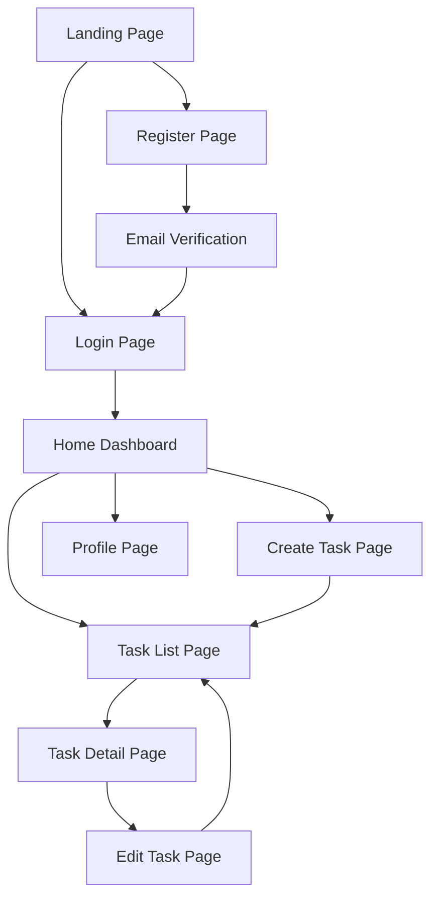

# Project Links - 产品需求文档

## 1. Product Overview
Project Links是一个面向个人用户的任务管理Web应用，专为需要高效管理日常任务的学生和自由职业者设计。该应用提供简洁直观的界面，帮助用户轻松创建、组织和跟踪任务进度，提升个人生产力和时间管理效率。

## 2. Core Features

### 2.1 User Roles
| Role | Registration Method | Core Permissions |
|------|---------------------|------------------|
| Regular User | Email registration | Can create, read, update, delete personal tasks; manage profile |
| Guest User | No registration required | Can view demo tasks (read-only) |

### 2.2 Feature Module
我们的任务管理应用包含以下主要页面：
1. **Home page**: 任务概览仪表板，快速操作面板，任务统计图表
2. **Task List page**: 任务列表展示，筛选排序功能，批量操作
3. **Task Detail page**: 任务详细信息，编辑功能，状态更新
4. **Create/Edit Task page**: 任务创建表单，任务编辑表单，分类标签管理
5. **Login page**: 用户登录表单，注册链接，密码重置
6. **Register page**: 用户注册表单，邮箱验证
7. **Profile page**: 用户信息管理，偏好设置，账户安全

### 2.3 Page Details
| Page Name | Module Name | Feature description |
|-----------|-------------|---------------------|
| Home page | Dashboard | Display task statistics, recent tasks, and quick action buttons |
| Home page | Quick Actions | Create new task, mark tasks complete, access frequently used features |
| Home page | Statistics Chart | Visual representation of task completion rates and productivity trends |
| Task List page | Task Display | Show all tasks with title, due date, priority, and status |
| Task List page | Filter & Sort | Filter by status, priority, category; sort by date, priority, alphabetical |
| Task List page | Batch Operations | Select multiple tasks, bulk delete, bulk status update |
| Task Detail page | Task Information | Display complete task details including description, attachments, comments |
| Task Detail page | Edit Controls | Inline editing of task properties, status updates, priority changes |
| Create/Edit Task page | Task Form | Input fields for title, description, due date, priority, category |
| Create/Edit Task page | Category Management | Create, edit, delete task categories and tags |
| Login page | Authentication Form | Email/password login, remember me option, forgot password link |
| Register page | Registration Form | Email, password, confirm password, terms acceptance |
| Register page | Email Verification | Send verification email, verify account activation |
| Profile page | User Settings | Update personal information, change password, notification preferences |
| Profile page | Account Management | Delete account, export data, privacy settings |

## 3. Core Process

**Regular User Flow:**
用户首先通过注册页面创建账户并验证邮箱，然后登录进入主页查看任务概览。用户可以通过创建任务页面添加新任务，在任务列表页面查看和管理所有任务，点击具体任务进入详情页面进行编辑或状态更新。用户还可以在个人资料页面管理账户信息和偏好设置。

**Guest User Flow:**
访客用户可以直接访问演示页面查看示例任务，了解应用功能，然后选择注册账户开始使用完整功能。

## 4. User Interface Design

### 4.1 Design Style
- **Primary Colors**: #3B82F6 (Blue), #10B981 (Green)
- **Secondary Colors**: #6B7280 (Gray), #F3F4F6 (Light Gray)
- **Button Style**: Rounded corners (8px), subtle shadows, hover animations
- **Font**: Inter font family, 14px base size, 16px for headings
- **Layout Style**: Clean card-based design, left sidebar navigation, responsive grid system
- **Icons**: Heroicons outline style, consistent 20px size

### 4.2 Page Design Overview
| Page Name | Module Name | UI Elements |
|-----------|-------------|-------------|
| Home page | Dashboard | Grid layout with metric cards, progress bars, recent task list with clean typography |
| Home page | Quick Actions | Floating action button (FAB) for new task, quick status toggle buttons |
| Task List page | Task Display | Card-based layout, status indicators with color coding, priority badges |
| Task List page | Filter Controls | Dropdown menus, search bar, toggle switches for different views |
| Task Detail page | Task Information | Two-column layout, expandable sections, inline editing with form validation |
| Create/Edit Task page | Form Layout | Single column form, date picker, dropdown selectors, rich text editor |
| Login/Register page | Authentication | Centered form design, social login buttons, clear error messaging |
| Profile page | Settings Panel | Tabbed interface, toggle switches, confirmation modals for destructive actions |

### 4.3 Responsiveness
应用采用移动优先的响应式设计，支持桌面端、平板和手机端。在移动设备上优化触摸交互，包括适当的按钮大小、手势支持和简化的导航结构。