# Project Links - 技术架构文档

## 1. Architecture Design


## 2. Technology Description

* **Frontend**: React\@18 + TypeScript\@5 + Vite\@5 + Tailwind CSS\@3

* **Backend**: Supabase (Backend-as-a-Service)

* **Database**: PostgreSQL (via Supabase)

* **Authentication**: Supabase Auth

* **State Management**: Zustand\@4

* **Data Fetching**: React Query\@5

* **Routing**: React Router\@6

* **Testing**: Vitest + React Testing Library

* **Code Quality**: ESLint + Prettier + Husky

* **Deployment**: Vercel

## 3. Route Definitions

| Route           | Purpose                                                       |
| --------------- | ------------------------------------------------------------- |
| /               | Home dashboard page, displays task overview and quick actions |
| /login          | User authentication page for login                            |
| /register       | User registration page with email verification                |
| /tasks          | Task list page with filtering and sorting capabilities        |
| /tasks/new      | Create new task page with form validation                     |
| /tasks/:id      | Task detail page for viewing and editing specific tasks       |
| /tasks/:id/edit | Dedicated task editing page                                   |
| /profile        | User profile management and settings page                     |
| /demo           | Guest demo page showcasing app features                       |

## 4. API Definitions

### 4.1 Core API

**Authentication APIs (Supabase Auth)**

```typescript
// User registration
supabase.auth.signUp({
  email: string,
  password: string,
  options: {
    data: {
      full_name: string
    }
  }
})

// User login
supabase.auth.signInWithPassword({
  email: string,
  password: string
})

// User logout
supabase.auth.signOut()
```

**Task Management APIs (Supabase Database)**

```typescript
// Get all tasks for user
supabase
  .from('tasks')
  .select('*')
  .eq('user_id', userId)
  .order('created_at', { ascending: false })

// Create new task
supabase
  .from('tasks')
  .insert({
    title: string,
    description: string,
    due_date: string,
    priority: 'low' | 'medium' | 'high',
    status: 'pending' | 'in_progress' | 'completed',
    category_id: string,
    user_id: string
  })

// Update task
supabase
  .from('tasks')
  .update(taskData)
  .eq('id', taskId)
  .eq('user_id', userId)

// Delete task
supabase
  .from('tasks')
  .delete()
  .eq('id', taskId)
  .eq('user_id', userId)
```

**Category Management APIs**

```typescript
// Get user categories
supabase
  .from('categories')
  .select('*')
  .eq('user_id', userId)

// Create category
supabase
  .from('categories')
  .insert({
    name: string,
    color: string,
    user_id: string
  })
```

## 5. Data Model

### 5.1 Data Model Definition

```mermaid
erDiagram
    USERS ||--o{ TASKS : creates
    USERS ||--o{ CATEGORIES : owns
    CATEGORIES ||--o{ TASKS : categorizes
    
    USERS {
        uuid id PK
        string email
        string full_name
        timestamp created_at
        timestamp updated_at
    }
    
    TASKS {
        uuid id PK
        string title
        text description
        date due_date
        string priority
        string status
        uuid user_id FK
        uuid category_id FK
        timestamp created_at
        timestamp updated_at
    }
    
    CATEGORIES {
        uuid id PK
        string name
        string color
        uuid user_id FK
        timestamp created_at
        timestamp updated_at
    }
```



### 5.2 Data Definition Language

**Users Table (handled by Supabase Auth)**

```sql
-- Users table is automatically created by Supabase Auth
-- We extend it with a profiles table for additional user data
CREATE TABLE profiles (
    id UUID REFERENCES auth.users(id) PRIMARY KEY,
    full_name TEXT,
    avatar_url TEXT,
    preferences JSONB DEFAULT '{}',
    created_at TIMESTAMP WITH TIME ZONE DEFAULT NOW(),
    updated_at TIMESTAMP WITH TIME ZONE DEFAULT NOW()
);

-- Enable RLS
ALTER TABLE profiles ENABLE ROW LEVEL SECURITY;

-- Policies
CREATE POLICY "Users can view own profile" ON profiles
    FOR SELECT USING (auth.uid() = id);

CREATE POLICY "Users can update own profile" ON profiles
    FOR UPDATE USING (auth.uid() = id);

CREATE POLICY "Users can insert own profile" ON profiles
    FOR INSERT WITH CHECK (auth.uid() = id);
```

**Categories Table**

```sql
CREATE TABLE categories (
    id UUID PRIMARY KEY DEFAULT gen_random_uuid(),
    name VARCHAR(100) NOT NULL,
    color VARCHAR(7) DEFAULT '#3B82F6',
    user_id UUID REFERENCES auth.users(id) ON DELETE CASCADE,
    created_at TIMESTAMP WITH TIME ZONE DEFAULT NOW(),
    updated_at TIMESTAMP WITH TIME ZONE DEFAULT NOW()
);

-- Indexes
CREATE INDEX idx_categories_user_id ON categories(user_id);

-- RLS Policies
ALTER TABLE categories ENABLE ROW LEVEL SECURITY;

CREATE POLICY "Users can manage own categories" ON categories
    USING (auth.uid() = user_id);

-- Grant permissions
GRANT SELECT ON categories TO anon;
GRANT ALL PRIVILEGES ON categories TO authenticated;
```

**Tasks Table**

```sql
CREATE TABLE tasks (
    id UUID PRIMARY KEY DEFAULT gen_random_uuid(),
    title VARCHAR(255) NOT NULL,
    description TEXT,
    due_date DATE,
    priority VARCHAR(10) DEFAULT 'medium' CHECK (priority IN ('low', 'medium', 'high')),
    status VARCHAR(20) DEFAULT 'pending' CHECK (status IN ('pending', 'in_progress', 'completed')),
    user_id UUID REFERENCES auth.users(id) ON DELETE CASCADE,
    category_id UUID REFERENCES categories(id) ON DELETE SET NULL,
    created_at TIMESTAMP WITH TIME ZONE DEFAULT NOW(),
    updated_at TIMESTAMP WITH TIME ZONE DEFAULT NOW()
);

-- Indexes
CREATE INDEX idx_tasks_user_id ON tasks(user_id);
CREATE INDEX idx_tasks_status ON tasks(status);
CREATE INDEX idx_tasks_due_date ON tasks(due_date);
CREATE INDEX idx_tasks_priority ON tasks(priority);
CREATE INDEX idx_tasks_category_id ON tasks(category_id);

-- RLS Policies
ALTER TABLE tasks ENABLE ROW LEVEL SECURITY;

CREATE POLICY "Users can manage own tasks" ON tasks
    USING (auth.uid() = user_id);

-- Grant permissions
GRANT SELECT ON tasks TO anon;
GRANT ALL PRIVILEGES ON tasks TO authenticated;

-- Update timestamp trigger
CREATE OR REPLACE FUNCTION update_updated_at_column()
RETURNS TRIGGER AS $$
BEGIN
    NEW.updated_at = NOW();
    RETURN NEW;
END;
$$ language 'plpgsql';

CREATE TRIGGER update_tasks_updated_at BEFORE UPDATE ON tasks
    FOR EACH ROW EXECUTE FUNCTION update_updated_at_column();

CREATE TRIGGER update_categories_updated_at BEFORE UPDATE ON categories
    FOR EACH ROW EXECUTE FUNCTION update_updated_at_column();

CREATE TRIGGER update_profiles_updated_at BEFORE UPDATE ON profiles
    FOR EACH ROW EXECUTE FUNCTION update_updated_at_column();
```

**Initial Data**

```sql
-- Insert default categories for new users (handled by application logic)
-- This will be done in the frontend when a user first registers

-- Example default categories
INSERT INTO categories (name, color, user_id) VALUES
('Work', '#3B82F6', 'user_id_placeholder'),
('Personal', '#10B981', 'user_id_placeholder'),
('Study', '#F59E0B', 'user_id_placeholder'),
('Health', '#EF4444', 'user_id_placeholder');
```

