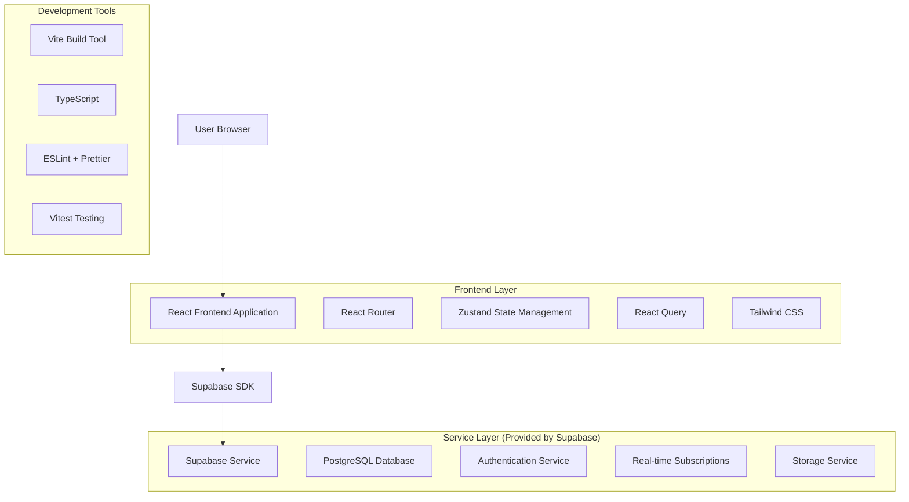
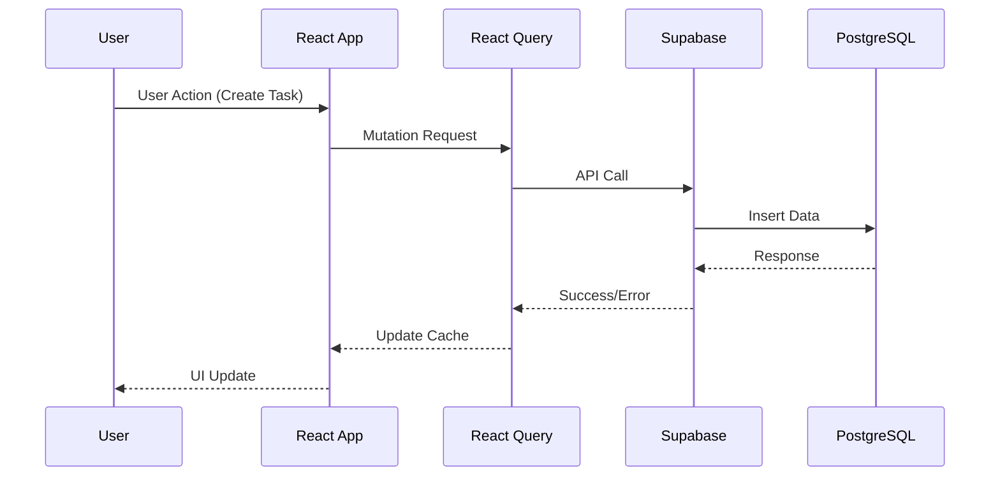
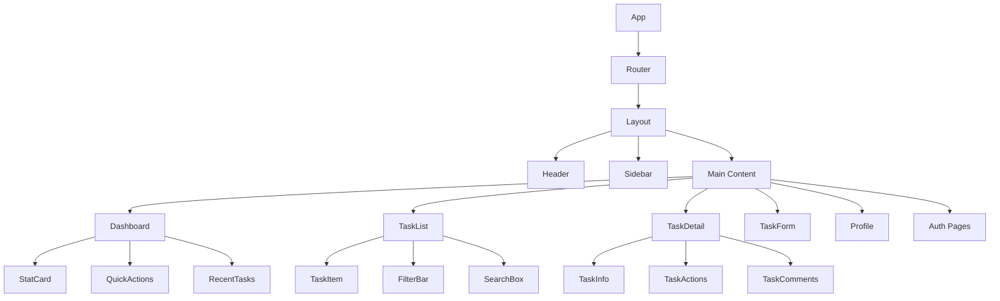

# 项目概览
**项目名称**：Project Links
**项目类型**：Web应用
**核心功能**：
- 用户认证（注册、登录、登出）
- 任务 CRUD（创建、读取、更新、删除）

**目标用户**：需要管理日常任务的个人用户，尤其是学生和自由职业者。

---

# 第一阶段：架构设计与环境准备

## Task 1: 顶层架构设计
请基于项目概览，设计一个清晰、可扩展且符合现代前端开发模式的项目架构。

**技术栈选型解释**：

1. **框架**：**React 18**
   - 选择理由：React拥有庞大的生态系统和活跃的社区支持，组件化开发模式非常适合任务管理应用的模块化需求
   - 优势：虚拟DOM提供优秀性能，Hooks API简化状态管理，丰富的第三方库生态
   - 在项目中的作用：构建用户界面，管理组件状态，处理用户交互

2. **语言**：**TypeScript 5**
   - 选择理由：提供静态类型检查，减少运行时错误，提高代码可维护性和团队协作效率
   - 优势：更好的IDE支持，自动补全，重构安全，接口定义清晰
   - 在项目中的作用：定义数据模型，API接口类型，组件Props类型

3. **UI 库**：**Tailwind CSS 3**
   - 选择理由：原子化CSS框架，快速构建响应式界面，避免CSS命名冲突
   - 优势：开发效率高，文件体积小，设计系统一致性好，易于维护
   - 在项目中的作用：样式系统，响应式布局，主题定制

4. **状态管理**：**Zustand 4**
   - 选择理由：轻量级状态管理库，API简洁，学习成本低，适合中小型项目
   - 优势：无样板代码，TypeScript友好，支持中间件，性能优秀
   - 在项目中的作用：全局状态管理，用户认证状态，任务数据缓存

5. **数据获取**：**React Query 5**
   - 选择理由：专业的服务端状态管理库，提供缓存、同步、错误处理等功能
   - 优势：自动缓存，后台更新，乐观更新，离线支持
   - 在项目中的作用：API调用管理，数据缓存，加载状态处理

6. **路由**：**React Router 6**
   - 选择理由：React官方推荐的路由库，功能完善，社区支持好
   - 优势：声明式路由，嵌套路由支持，代码分割友好
   - 在项目中的作用：页面导航，路由保护，参数传递

7. **数据库**：**PostgreSQL (via Supabase)**
   - 选择理由：功能强大的关系型数据库，支持JSON数据类型，扩展性好
   - 优势：ACID事务支持，丰富的数据类型，强大的查询能力
   - 在项目中的作用：存储用户数据，任务信息，分类数据

8. **用户认证**：**Supabase Auth**
   - 选择理由：开箱即用的认证服务，支持多种登录方式，安全性高
   - 优势：JWT令牌管理，行级安全策略，社交登录支持
   - 在项目中的作用：用户注册登录，会话管理，权限控制

9. **工程化**：**Vite 5 + ESLint + Prettier**
   - 选择理由：Vite提供快速的开发体验，ESLint保证代码质量，Prettier统一代码风格
   - 优势：热更新快，构建速度快，代码质量保证
   - 在项目中的作用：开发环境，代码检查，格式化，构建打包

10. **部署**：**Vercel**
    - 选择理由：专为前端优化的部署平台，与React生态集成度高
    - 优势：自动部署，CDN加速，预览环境，零配置
    - 在项目中的作用：生产环境部署，CI/CD流程，性能优化

11. **测试**：**Vitest + React Testing Library**
    - 选择理由：Vitest与Vite集成度高，RTL专注于用户行为测试
    - 优势：测试速度快，API简洁，测试覆盖率好
    - 在项目中的作用：单元测试，集成测试，组件测试

12. **监控**：**Vercel Analytics + Sentry**
    - 选择理由：Vercel Analytics提供性能监控，Sentry提供错误追踪
    - 优势：实时监控，错误报告，性能分析
    - 在项目中的作用：应用性能监控，错误日志收集，用户行为分析

13. **其他**：**Husky + lint-staged + Commitizen**
     - 选择理由：Git hooks管理，提交前代码检查，规范化提交信息
     - 优势：代码质量保证，团队协作规范，自动化流程
     - 在项目中的作用：代码提交规范，自动化检查，团队协作

---

# 第二阶段：系统架构设计

## Task 2: 系统架构图

### 2.1 整体架构



### 2.2 数据流架构



### 2.3 组件架构



---

# 第三阶段：开发环境配置

## Task 3: 项目初始化

### 3.1 环境要求
- Node.js >= 18.0.0
- npm >= 9.0.0 或 yarn >= 1.22.0
- Git >= 2.30.0

### 3.2 项目结构

```
project-links/
├── public/
│   ├── favicon.ico
│   └── index.html
├── src/
│   ├── components/
│   │   ├── ui/
│   │   ├── layout/
│   │   ├── forms/
│   │   └── common/
│   ├── pages/
│   │   ├── auth/
│   │   ├── dashboard/
│   │   ├── tasks/
│   │   └── profile/
│   ├── hooks/
│   ├── services/
│   ├── stores/
│   ├── types/
│   ├── utils/
│   ├── styles/
│   ├── App.tsx
│   └── main.tsx
├── tests/
│   ├── __mocks__/
│   ├── components/
│   └── utils/
├── docs/
├── .env.example
├── .env.local
├── .gitignore
├── .eslintrc.js
├── .prettierrc
├── .editorconfig
├── tailwind.config.js
├── vite.config.ts
├── tsconfig.json
├── package.json
└── README.md
```

### 3.3 安装步骤

```bash
# 1. 克隆项目
git clone <repository-url>
cd project-links

# 2. 安装依赖
npm install

# 3. 环境配置
cp .env.example .env.local
# 编辑 .env.local 文件，填入 Supabase 配置

# 4. 启动开发服务器
npm run dev

# 5. 运行测试
npm run test

# 6. 代码检查
npm run lint
npm run format
```

### 3.4 环境变量配置

```env
# Supabase Configuration
VITE_SUPABASE_URL=your_supabase_project_url
VITE_SUPABASE_ANON_KEY=your_supabase_anon_key

# Application Configuration
VITE_APP_NAME=Project Links
VITE_APP_VERSION=1.0.0
VITE_APP_ENV=development

# Analytics (Optional)
VITE_VERCEL_ANALYTICS_ID=your_analytics_id
VITE_SENTRY_DSN=your_sentry_dsn
```

---

# 第四阶段：核心功能实现

## Task 4: 功能模块开发计划

### 4.1 开发优先级

**Phase 1: 基础架构 (Week 1-2)**
- [ ] 项目初始化和环境配置
- [ ] 基础组件库搭建
- [ ] 路由系统配置
- [ ] 状态管理设置
- [ ] Supabase 集成

**Phase 2: 用户认证 (Week 2-3)**
- [ ] 用户注册功能
- [ ] 用户登录功能
- [ ] 邮箱验证
- [ ] 密码重置
- [ ] 用户会话管理

**Phase 3: 任务管理核心功能 (Week 3-5)**
- [ ] 任务创建
- [ ] 任务列表展示
- [ ] 任务详情查看
- [ ] 任务编辑更新
- [ ] 任务删除
- [ ] 任务状态管理

**Phase 4: 高级功能 (Week 5-6)**
- [ ] 任务分类管理
- [ ] 任务筛选排序
- [ ] 任务搜索
- [ ] 批量操作
- [ ] 数据统计图表

**Phase 5: 用户体验优化 (Week 6-7)**
- [ ] 响应式设计
- [ ] 加载状态优化
- [ ] 错误处理
- [ ] 离线支持
- [ ] 性能优化

**Phase 6: 测试和部署 (Week 7-8)**
- [ ] 单元测试
- [ ] 集成测试
- [ ] E2E 测试
- [ ] 生产环境部署
- [ ] 监控和分析

### 4.2 代码规范

**命名规范**
- 组件名：PascalCase (TaskList, UserProfile)
- 文件名：kebab-case (task-list.tsx, user-profile.tsx)
- 变量名：camelCase (taskList, userProfile)
- 常量名：SNAKE_CASE (API_BASE_URL, MAX_TASKS_PER_PAGE)
- CSS类名：BEM命名法 (task-list__item, task-list__item--active)

**文件组织**
- 每个组件一个文件
- 相关文件放在同一目录
- 使用 index.ts 文件导出
- 测试文件与源文件同目录

**代码质量**
- 使用 TypeScript 严格模式
- 所有函数必须有类型注解
- 组件必须有 Props 接口定义
- 复杂逻辑必须有注释
- 提交前必须通过 ESLint 和 Prettier 检查

---

# 第五阶段：部署和运维

## Task 5: 部署配置

### 5.1 Vercel 部署

```bash
# 1. 安装 Vercel CLI
npm i -g vercel

# 2. 登录 Vercel
vercel login

# 3. 部署项目
vercel

# 4. 配置环境变量
vercel env add VITE_SUPABASE_URL
vercel env add VITE_SUPABASE_ANON_KEY

# 5. 重新部署
vercel --prod
```

### 5.2 CI/CD 配置

```yaml
# .github/workflows/deploy.yml
name: Deploy to Vercel

on:
  push:
    branches: [main]
  pull_request:
    branches: [main]

jobs:
  test:
    runs-on: ubuntu-latest
    steps:
      - uses: actions/checkout@v3
      - uses: actions/setup-node@v3
        with:
          node-version: '18'
          cache: 'npm'
      - run: npm ci
      - run: npm run lint
      - run: npm run test
      - run: npm run build

  deploy:
    needs: test
    runs-on: ubuntu-latest
    if: github.ref == 'refs/heads/main'
    steps:
      - uses: actions/checkout@v3
      - uses: amondnet/vercel-action@v20
        with:
          vercel-token: ${{ secrets.VERCEL_TOKEN }}
          vercel-org-id: ${{ secrets.ORG_ID }}
          vercel-project-id: ${{ secrets.PROJECT_ID }}
          vercel-args: '--prod'
```

### 5.3 性能监控

**Vercel Analytics 配置**
```typescript
// src/main.tsx
import { inject } from '@vercel/analytics';

if (import.meta.env.PROD) {
  inject();
}
```

**Sentry 错误监控**
```typescript
// src/utils/sentry.ts
import * as Sentry from '@sentry/react';

Sentry.init({
  dsn: import.meta.env.VITE_SENTRY_DSN,
  environment: import.meta.env.VITE_APP_ENV,
  tracesSampleRate: 1.0,
});
```

---

# 项目文档

## 相关文档
- [产品需求文档](./.trae/documents/product_requirements.md)
- [技术架构文档](./.trae/documents/technical_architecture.md)
- [API 文档](./docs/api.md)
- [组件文档](./docs/components.md)
- [部署指南](./docs/deployment.md)

## 贡献指南

1. Fork 项目
2. 创建功能分支 (`git checkout -b feature/amazing-feature`)
3. 提交更改 (`git commit -m 'Add some amazing feature'`)
4. 推送到分支 (`git push origin feature/amazing-feature`)
5. 创建 Pull Request

## 许可证

MIT License - 详见 [LICENSE](./LICENSE) 文件

## 联系方式

- 项目维护者：[Your Name]
- 邮箱：[your.email@example.com]
- 项目链接：[https://github.com/yourusername/project-links]
